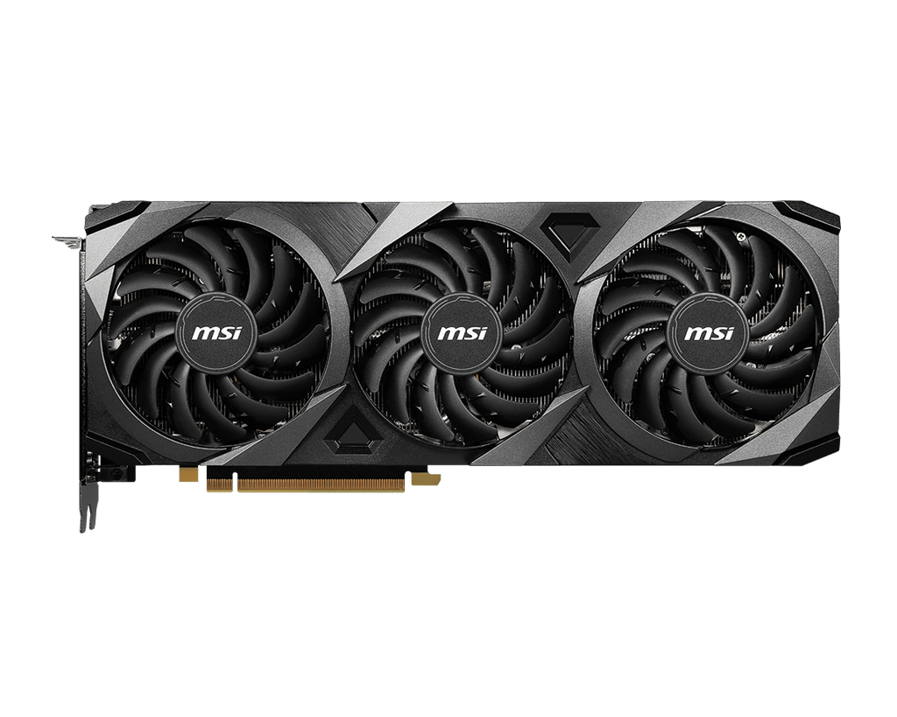

# E-Commerce Gamergy Store. 

- Tienda gamer desarrollada y creada para trabajo Final de Coderhouse.
- Autor: Rocchietti Lucas



### Librerias Utilizadas: 
```npm i react-router-dom```
- [React Router Dom](https://reactrouter.com/en/main).

```npm i firebase```
- [Firebase Google](https://console.firebase.google.com/u/0/).

```npm i react-spinners```
- [Spinners charge](https://www.npmjs.com/package/react-spinners).

# Pasos para levantar el producto en cuestión: 
```
git clone https://github.com/Rocchietti/trabajoReact.git 
```

``` npm i ```

``` npm start ```

### Observaciones: 
- Para dejar de usar y guardar el producto:

``` Control + c En la terminal ``` 

``` git status ```

``` git add . = Guarda todos los archivos nuevos o que se editaron. ```

``` git commit -m 'nombre commit' = crea una nueva hoja donde se muestran todos los datos que se han guardado con anterioridad ```

``` git push = sube las correcciones a tu proyecto en github ```

- En caso de querer hacer una correccion que no se sobreescriba al momento de guardar: ``` git branch '' ```, ``` git checkout 'RAMANUEVA' ``` Y ``` git add. ```  a los nuevos archivos. 

- En caso de finalizar y unir todas las ramas: ``` git merge 'master' ```

``` 
NO CONTIENE IMAGENES 
```